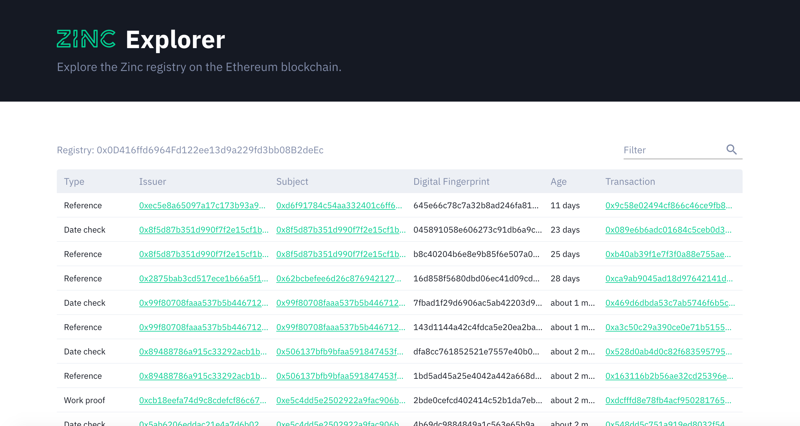

# Registry Explorer

This is a visualisation of the Zinc ERC780 claims registry contract. You can use it to explore the identities and identity claims created on Zinc. View it live [here](https://zinc.work/explore).

## Etherscan

This explorer is powered by the [Etherscan](https://etherscan.io/) API. 

## ERC780

ERC780 is a smart contract design by [uPort](https://www.uport.me/) for recording identity claims on the Ethereum blockchain. 

## Credit 

Thanks to [@wagerfield](https://github.com/wagerfield/) who assisted with the table component. 
